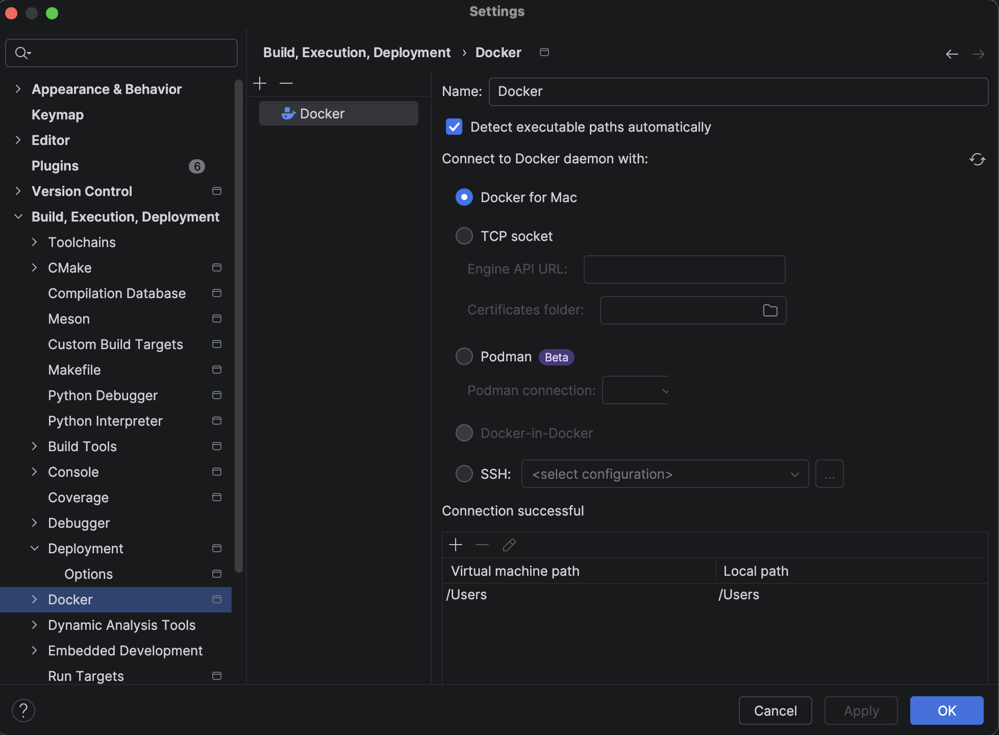
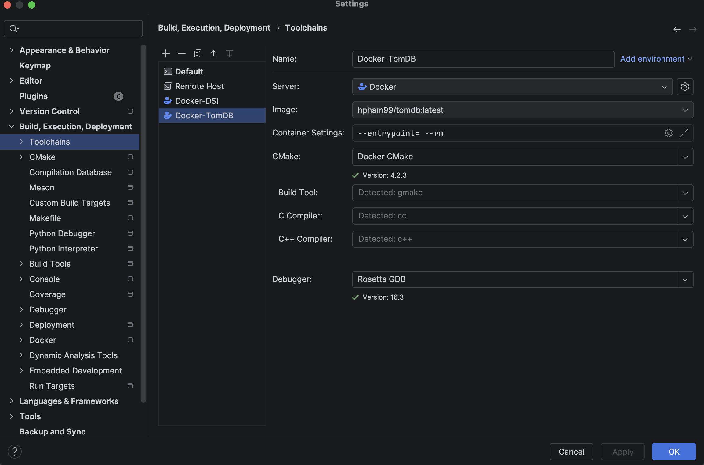
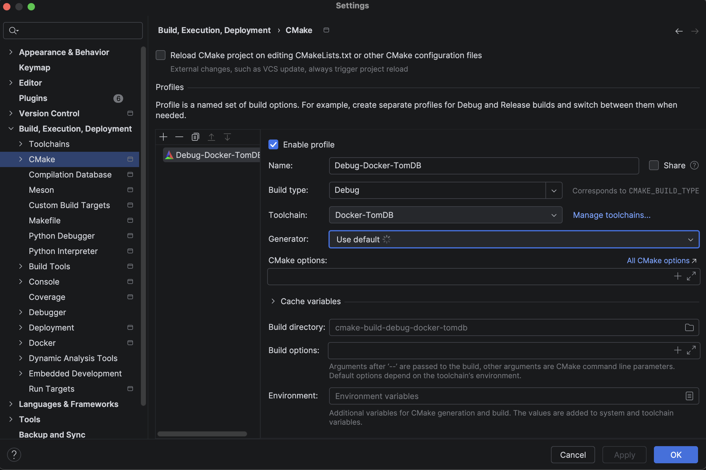
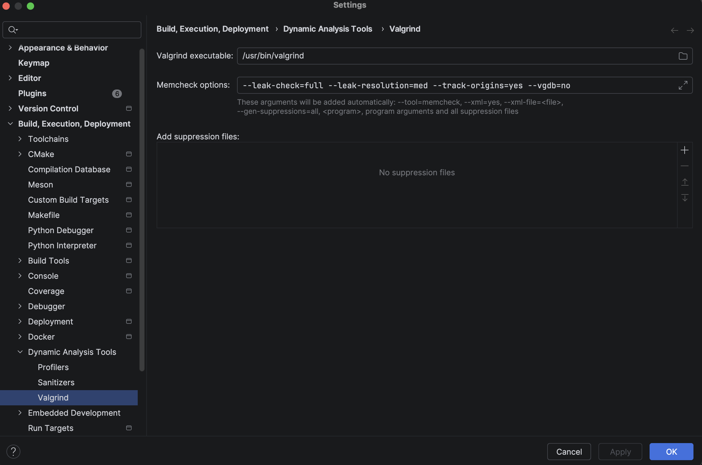
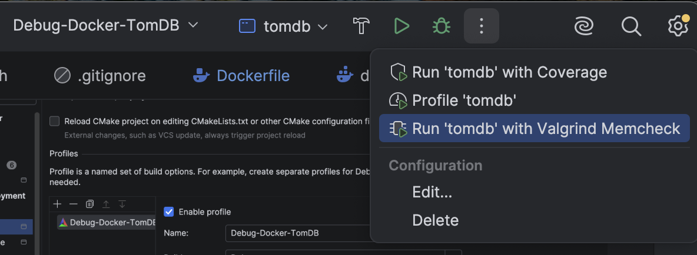
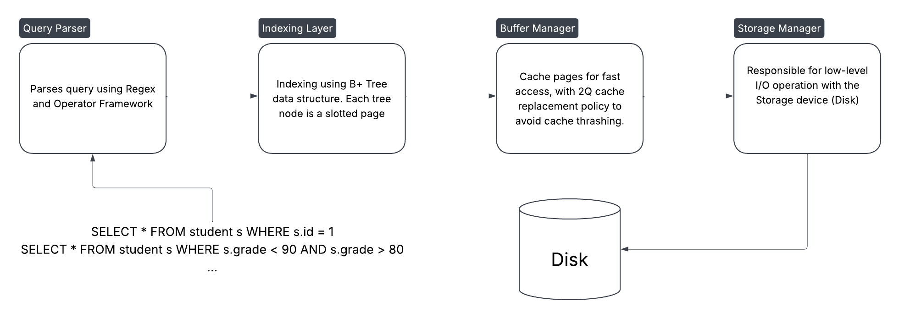

# TomDB
Tom DB is a relational database management system built for the purpose of learning about Database System implementation.
It should not be used in any production system.

## Table of Contents
- [Development Setup](#development-setup)
  - [MacOS - Apple Sillion](#macos---apple-silicon)
- [High-Level Architecture](#high-level-architecture)

## Development Setup

To avoid potential issues with different processor architectures or operating systems, development should be done
inside the provider Docker container built from Ubuntu 26.04 LTS based image. See https://hub.docker.com/r/hpham99/tomdb

This section guides you through setting up your local development setup with CLion.

First, navigate to the root directory of TomDB, then build the container:
```
docker compose up -d
```

### MacOS - Apple Silicon
Go to Settings > Build, Execution, Deployment > Docker, make the following setup:

   

Go to Toolchains, make the following setup:

   

Set debugger to **Rosetta GDB**

   

Setup Valgrind:

  

Then, you can run Valgrind using the profiler option

  

## High-Level Architecture!
