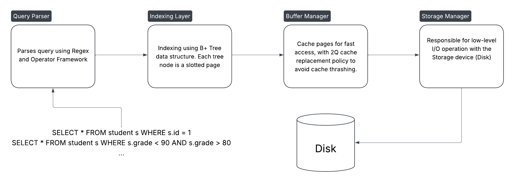

# TomDB

TomDB is a learning project for database implementation and distributed systems, with the goal of building a distributed relational database. The current implementation includes records, slotted pages, file storage, and a buffer manager. It should not be used in production.

## Documentation

- [Design overview and reading guide](docs/design/README.md): component relationships and a walkthrough of the storage engine.
- [Development setup](docs/development.md): Docker, CLion, and debugging setup.

The design docs are grouped by [records](docs/design/records/fields-and-tuples.md), [storage](docs/design/storage/storage-manager.md), and [buffer management](docs/design/buffer/buffer-manager.md). They describe current behavior, ownership, tradeoffs, and implementation limits.

## High-Level Architecture

The diagram shows the broader architecture direction; the roadmap below distinguishes implemented components from planned work.

## Project Roadmap
### Storage engine
✅ Page, tuple, field \
✅ File manager \
✅ Storage manager \
✅ Buffer manager \
⏳ B-tree indexing

### Query layer
⏳ Query parser \
⏳ Query planner and execution engine

### Reliability
⏳ Transactions and concurrency control \
⏳ Write-ahead logging and crash recovery

### Serving
⏳ Database server and client protocol

### Distributed architecture
⏳ Partitioning and data placement \
⏳ Replication and consensus \
⏳ Distributed transactions / consistency model \
⏳ Distributed query execution \
⏳ Membership, failure detection, and rebalancing
