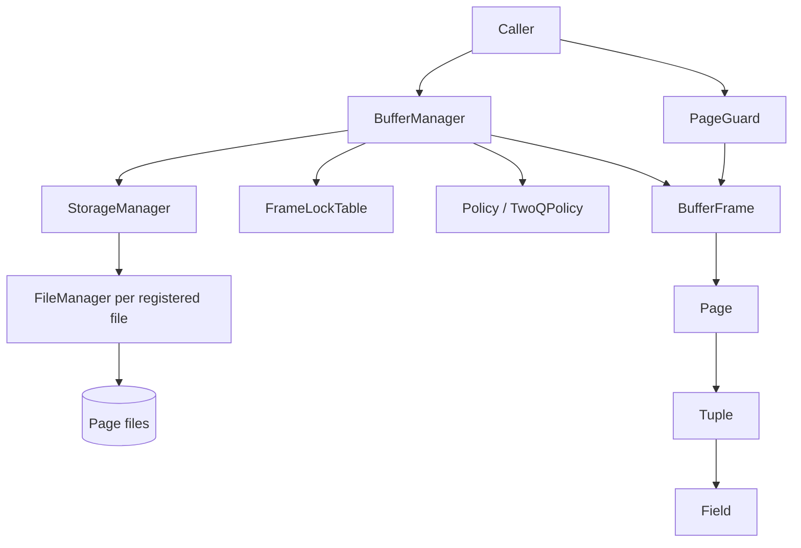

# TomDB design documents

These documents describe the current implementation of TomDB's completed record, storage, and buffer components. They record behavior, ownership, design tradeoffs, and known implementation limits; completion does not imply guarantees beyond those described here.

## Suggested reading order

Start with the component map below, then follow the data from values to disk to cached access:

1. [Configuration and identifiers](configuration.md) explains the shared sizes, IDs, and persistent-format assumptions.
2. [Fields and tuples](records/fields-and-tuples.md) and [pages](records/pages.md) explain how values become page bytes.
3. [File manager](storage/file-manager.md) and [storage manager](storage/storage-manager.md) explain how pages are persisted and addressed across files.
4. [Buffer manager](buffer/buffer-manager.md) explains the caller-facing pinning API and page lifecycle.
5. [Frames and guards](buffer/frames-and-guards.md), [frame locks](buffer/frame-lock-table.md), and [replacement policy](buffer/replacement-policy.md) explain buffer ownership, synchronization, and eviction.

For an API usage example, go directly to the [buffer manager](buffer/buffer-manager.md#usage). Each component document links to its implementation and existing tests.

## Component relationships

A caller registers a file and pins a page through `BufferManager`. The manager loads or reuses a frame and returns a guard. The caller uses an exclusive guard for modifications and marks it dirty. Guard destruction releases the pin; a later eviction writes a dirty frame through the storage and file managers. Explicit flushing is also available.

The executable in [src/main.cpp](../../src/main.cpp) is a placeholder. Query processing, indexes, transactions, recovery, and distributed execution have no current implementation here and are outside these documents.
